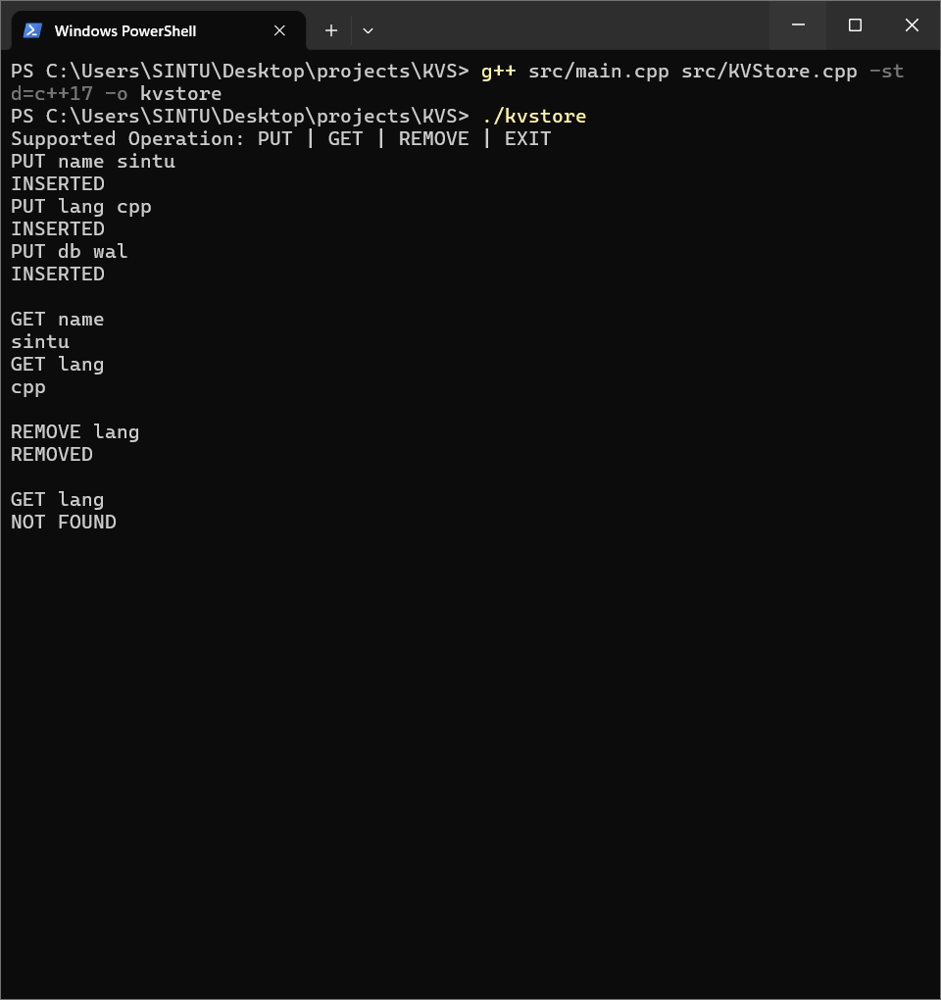
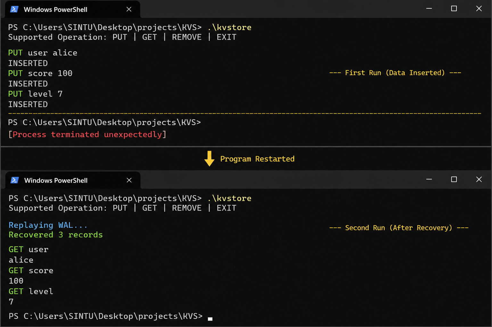
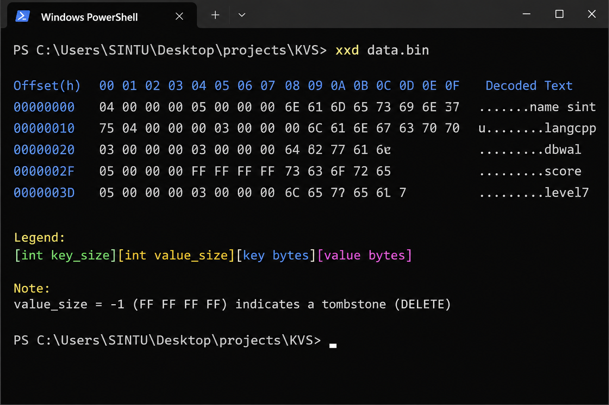

# ⚡ LogStoreDB


A crash-safe append-only key-value storage engine built in modern C++.

LogStoreDB implements core database internals including:

- Write-Ahead Logging (WAL)
- Deterministic crash recovery
- Tombstone-based deletes
- Log-structured storage
- Thread-safe operations

Inspired by storage systems like LevelDB, RocksDB, Bitcask, and Redis AOF.

---

# 📑 Table of Contents

- [Features](#-features)
- [Architecture Overview](#-architecture-overview)
- [Write Path](#-write-path-put)
- [Delete Path](#-delete-path-remove)
- [Crash Recovery](#-crash-recovery)
- [Binary Log Format](#-binary-log-format)
- [Thread Safety](#-thread-safety)
- [Project Structure](#-project-structure)
- [Screenshots](#-screenshots)
- [Build & Run](#-build--run)
- [Design Decisions](#-design-decisions)
- [Crash Safety](#-crash-safety)
- [Limitations](#-limitations)
- [Future Improvements](#-future-improvements)
- [Learning Outcomes](#-learning-outcomes)
- [Inspiration](#-inspiration)
- [License](#-license)

---

# 🚀 Features

## 💾 Persistent Storage

- Append-only binary Write-Ahead Log (WAL)
- Durable disk-first writes
- Crash-safe recovery using deterministic replay

## ⚡ Key-Value Operations

- PUT / GET / REMOVE support
- Last-write-wins semantics
- Tombstone-based logical deletes

## 🧵 Concurrency

- Thread-safe operations using `std::mutex`
- Atomic log + memory updates
- Safe concurrent access

## 🖥️ Interactive CLI

- Simple command-line interface
- Real-time operations
- Persistent state across restarts

---

# 🧠 Architecture Overview

LogStoreDB follows a log-structured architecture.

Every modification is first appended to disk before updating memory.

```text
Client Request
      │
      ▼
+----------------+
|    KVStore     |
+----------------+
   │         │
   ▼         ▼
Memory      WAL File
(HashMap)   data.bin
```

The WAL (`data.bin`) acts as the single source of truth.

---

# ✍️ Write Path (PUT)

```text
PUT key value
      │
      ▼
1. Append binary record to WAL
2. Flush write to disk
3. Update in-memory hashmap
```

Durability is guaranteed because disk is written before memory is updated.

---

# ❌ Delete Path (REMOVE)

Deletes are implemented using tombstone records.

```text
REMOVE key
      │
      ▼
1. Append tombstone record
2. Remove key from memory
```

A tombstone is represented by:

```text
value_size = -1
```

Old records remain in the log and are ignored during replay.

---

# 🔄 Crash Recovery

On startup, the entire WAL is replayed sequentially.

```text
Replay WAL
     │
     ▼
Reconstruct latest state
     │
     ▼
Last write wins
```

The recovery system safely ignores:

- Partial records
- Corrupted tail writes
- Incomplete shutdowns

---

# 📦 Binary Log Format

Each WAL entry is stored in binary format:

```text
[int key_size]
[int value_size]
[key bytes]
[value bytes]
```

## Tombstone Record

```text
value_size == -1
```

This indicates a DELETE operation.

Using explicit sizes before data enables precise parsing in raw binary streams.

---

# 🔒 Thread Safety

All operations are protected using a single global `std::mutex`.

Protected operations include:

- PUT
- GET
- REMOVE
- WAL replay

This guarantees:

- No race conditions
- No interleaved log writes
- Atomic memory + disk consistency

The design prioritizes correctness and simplicity over parallel throughput.

---

# 📂 Project Structure

```text
LogStoreDB/
│
├── src/
│   ├── KVStore.cpp
│   ├── KVStore.h
│   └── main.cpp
│
├── data/
│   └── data.bin
│
├── screenshots/
│   ├── cli-demo.png
│   ├── recovery-demo.png
│   └── wal-hexdump.png
│
├── README.md
└── LICENSE
```

---

# 📸 Screenshots

## CLI Demo



---

## Crash Recovery Demo


---

## WAL Binary Dump


---

# 🛠️ Build & Run

## Compile

```bash
g++ src/main.cpp src/KVStore.cpp -std=c++17 -o kvstore
```

## Run

```bash
./kvstore
```

---

# 💻 Supported Commands

```text
PUT key value
GET key
REMOVE key
EXIT
```

---

# 🧠 Design Decisions

## Why Append-Only Logging?

Appending avoids expensive random disk writes and simplifies crash recovery.

## Why Tombstones Instead of Physical Deletes?

Physical deletion inside binary files is unsafe and inefficient.
Tombstones preserve operation history while enabling deterministic replay.

## Why Replay-Based Recovery?

The WAL acts as the single source of truth.
State reconstruction guarantees consistency after crashes.

## Why Single Mutex?

The project prioritizes correctness and predictable behavior before introducing fine-grained concurrency.

---

# 🧪 Crash Safety

The storage engine is resilient to:

- Forced termination during writes
- Partial WAL records
- Unexpected shutdowns
- Corrupted log tails

Recovery is deterministic because the WAL is replayed sequentially.

---

# ⚠️ Limitations

- No log compaction
- File size grows indefinitely
- Single global mutex
- No networking layer
- No disk-based indexing
- No unit test suite
- No replication or snapshots

This project focuses primarily on storage engine fundamentals.

---

# 🚀 Future Improvements

- [ ] Log compaction
- [ ] Offset-based indexing
- [ ] Read-write locks
- [ ] Multi-threaded replay
- [ ] Networking layer
- [ ] Benchmark suite
- [ ] Unit & integration tests
- [ ] Disk-backed SSTables
- [ ] LSM-tree style compaction

---

# 📚 Learning Outcomes

This project demonstrates understanding of:

- Binary serialization
- Write-Ahead Logging (WAL)
- Log-structured storage engines
- Crash recovery systems
- Tombstone-based deletes
- Concurrency control using mutexes
- Deterministic replay
- Persistent storage internals
- Separation of storage and interface layers

---

# 📖 Inspiration

Inspired by concepts used in modern storage engines and databases:

- LevelDB
- RocksDB
- Bitcask
- Redis AOF
- LSM-tree architectures

---

# 📄 License

MIT License

This project was built for educational and learning purposes.

---

# ⭐ Support

If you found this project useful, consider giving the repository a star.